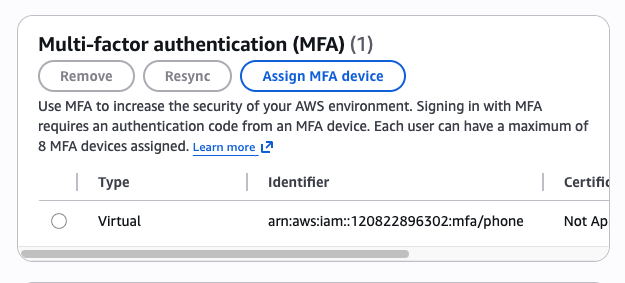
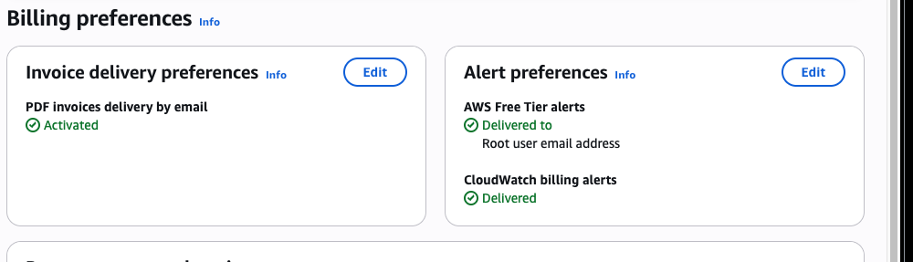
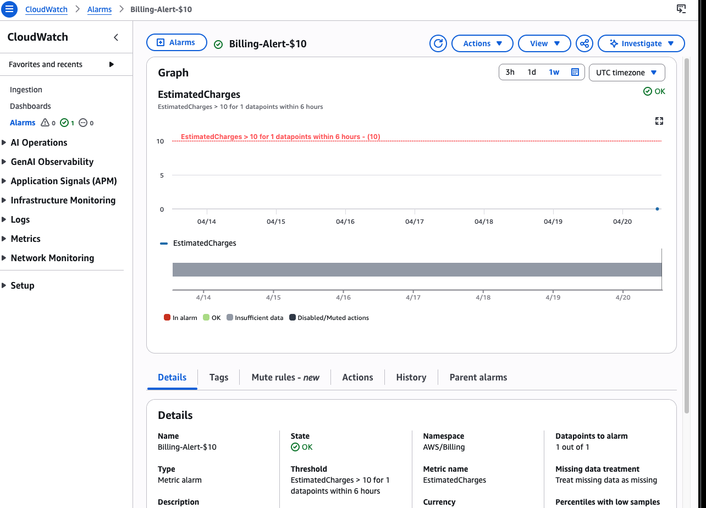
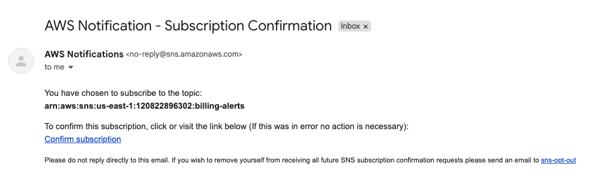
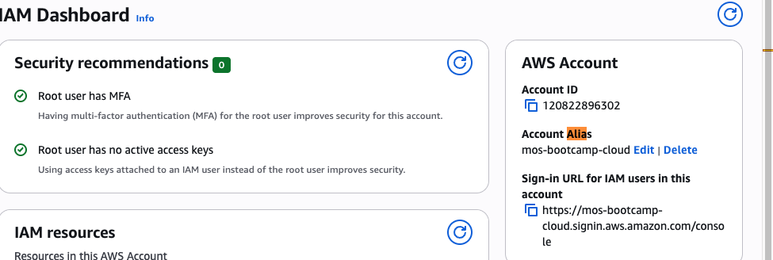
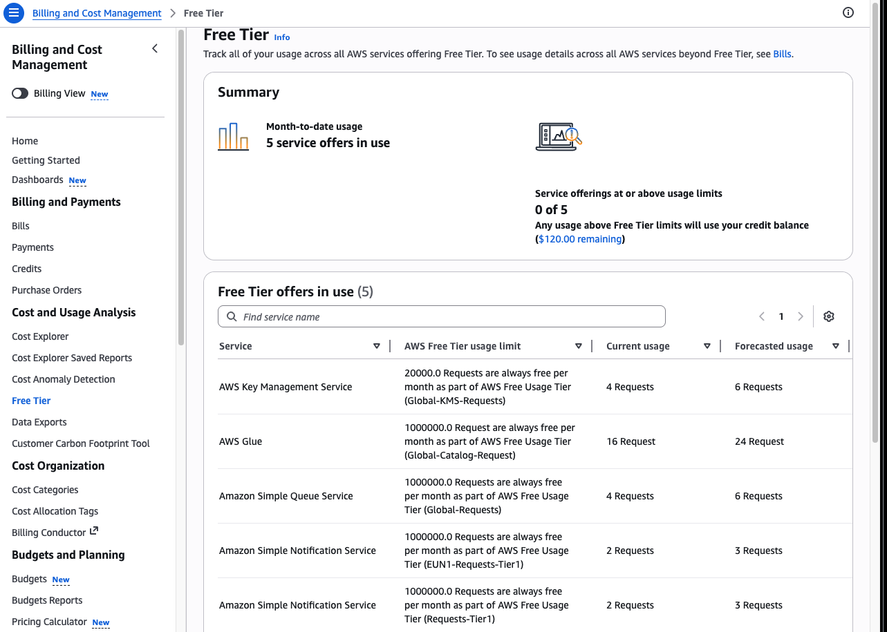

# AWS Account Setup Lab - Solution

**Student Name:** Mos 
**Date Completed:** 20.04.2026

---

## Exercise 1: MFA Configuration

### Screenshot:

### Notes:
- Authenticator app used: Google Authenticator
- MFA setup completed successfully: Yes
- Backup codes saved: Yes

---

## Exercise 2: Billing Alerts

### Screenshots:

**Billing Preferences:**

**Billing Alarm:**

**SNS Confirmation:**

### Configuration Details:
- Alert threshold: $10
- Email confirmed: Yes
- Additional thresholds created (bonus): [Yes / No - if yes, list amounts]

---

## Exercise 3: Account Alias

### Screenshot:

### Account Details:
- **Account Alias:** mos-bootcamp-cloud
- **Sign-In URL:** `https://mos-bootcamp-cloud.signin.aws.amazon.com/console`
- **Tested successfully:** Yes

---

## Exercise 4: Free Tier Dashboard

### Screenshot:

### Current Free Tier Usage Summary:

| Service | Current Usage | Free Tier Limit | Status |
|---------|--------------|-----------------|--------|
| AWS Key Management Service (KMS) | 4 / 20,000 requests | 20,000 requests/month | Green |
| AWS Glue | 16 / 1,000,000 requests | 1,000,000 requests/month | Green |
| Amazon Simple Queue Service (SQS) | 4 / 1,000,000 requests | 1,000,000 requests/month | Green |
| Amazon Simple Notification Service (SNS) | 2 / 1,000,000 requests | 1,000,000 requests/month | Green |

### Notes:
- Any services approaching limits? [Yes / No - if yes, which ones?]
- Any unexpected usage? [Yes / No - if yes, describe]

---

## Exercise 5: Reflection Questions

### 1. Why is MFA important even for a personal learning account?

**Your Answer:**
If the root user is unprotected, an attacker could gain full control of the account, steal data, create resources that incur high costs (maybe they would do bitcoin mining), and potentially lock the original account owner out completely.

---

### 2. What would happen if you left your root user unprotected?

**Your Answer:**
If the root user is left unprotected, an attacker could gain full administrative control or delete all resources and data. Recovery would involve contacting the cloud provider’s support to verify your identity and regain access.

---

### 3. How do billing alerts help prevent unexpected charges?

**Your Answer:**
Billing alerts notifies when spending reaches a set threshold, allowing to quickly take action, for exmaple, stopping resources before costs get too high.

---

### 4. What threshold did you set for your billing alert and why?

**Your Answer:**
I set a low threshold $10, since I am using the free tier and my usage is minimal, and this helps take quick action before costs increase, I would add higher thresholds at $20 and $100 for additional warnings.

---

### 5. What is your account alias and why did you choose it?

**Your Answer:**
- **Alias:** mos-bootcamp-cloud
- **Reasoning:** It had to be a unique alias that reflects the purpose of the bootcamp and cloud engineering.

---

### 6. What services are you currently using according to the Free Tier dashboard?

**Your Answer:**
1. AWS Key Management Service (KMS)
2. AWS Glue
3. Amazon Simple Queue Service (SQS)
4. Amazon Simple Notification Service (SNS)

SNS tracks Free Tier usage separately per region, so even though it’s the same service, it shows up twice.
* EUN1-Requests-Tier1 → usage in a specific region (e.g., EU North / Stockholm)
* Requests-Tier1 → usage in another region (like US East)

---

## Bonus Challenges Completed (Optional)

### Challenge 1: Multiple Billing Alert Thresholds

- [ ] $5 threshold
- [ ] $25 threshold
- [ ] $50 threshold

**Screenshots (if completed):**
[Add screenshots here]

---

### Challenge 2: CloudTrail Enabled

- [ ] CloudTrail enabled
- [ ] Logging to S3 configured

**Notes:**
[Add any notes about CloudTrail setup]

---

### Challenge 3: AWS Trusted Advisor Reviewed

- [ ] Accessed Trusted Advisor
- [ ] Reviewed recommendations

**Key recommendations found:**
[List any recommendations you found]

---

## Lessons Learned

**What was the most challenging part of this lab?**

The most challenging part was understanding how AWS billing and Free Tier usage are tracked across different regions, especially why services like SNS appear multiple times.

---

**What would you do differently next time?**

Next time, I would set up multiple billing alerts earlier and explore the Free Tier dashboard more carefully to better understand usage breakdowns from the start.

---

**What security practices will you implement going forward?**

Definetly always enable MFA on root and IAM users, avoid using the root account for daily tasks, regularly monitor billing and usage.

---

## Checklist Before Submission

- [X] All required screenshots captured and saved
- [X] Screenshots are clear and show relevant information
- [X] All reflection questions answered thoroughly
- [X] Account alias documented
- [X] Free Tier usage documented
- [X] Work committed to Git
- [X] Pull request created
- [X] PR URL submitted to Student Portal

---

**Lab Completed By:** Mos
**Date:** 20.04.2026
